# c4core - C++ core utilities

[](https://github.com/biojppm/c4core/blob/master/LICENSE.txt)
[](https://github.com/biojppm/c4core/actions?query=ci)
[](https://codecov.io/gh/biojppm/c4core)
<!-- [](https://coveralls.io/github/biojppm/c4core) -->


c4core is a library of low-level C++ utilities, written with low-latency
projects in mind.

Some of the utilities provided by c4core have already equivalent
functionality in the C++ standard, but they are provided as the existing C++
equivalent may be insufficient (eg, std::string_view), inefficient (eg,
std::string), heavy (eg streams), or plainly unusable on some
platforms/projects, (eg exceptions); some other utilities have equivalent
under consideration for C++ standardisation; and yet some other utilities
have (to my knowledge) no equivalent under consideration. Be that as it may,
I've been using these utilities in this or similar forms for some years now,
and I've found them incredibly useful in my projects. I'm packing these as a
separate library, as all of my projects use it.

c4core is [extensively unit-tested in Linux, Windows and
MacOS](https://github.com/biojppm/c4core/actions). The tests cover
x64, x86, arm, wasm (emscripten), aarch64, ppc64le and s390x
architectures, and include analysing c4core with:
  * valgrind
  * clang-tidy
  * clang sanitizers:
    * memory
    * address
    * undefined behavior
    * thread
  * [LGTM.com](https://lgtm.com/projects/g/biojppm/c4core)

c4core also works [in
bare-metal](https://github.com/biojppm/c4core/issues/63), as well as
[in RISC-V](https://github.com/biojppm/c4core/pull/69), and [in
LoongArch](https://github.com/biojppm/c4core/pull/119), but at the
moment it's not easy to add automated tests to the CI, so for now
these are not in the list of official architectures. 

<!-- markdown-toc start - Don't edit this section. Run M-x markdown-toc-refresh-toc -->
- [c4core - C++ core utilities](#c4core---c-core-utilities)
    - [Obtaining c4core](#obtaining-c4core)
    - [Using c4core in your project](#using-c4core-in-your-project)
        - [CMake](#cmake)
        - [Bazel](#bazel)
        - [Header-only](#header-only)
        - [Package managers](#package-managers)
    - [Quick tour](#quick-tour)
        - [Writeable string views: c4::substr and c4::csubstr](#writeable-string-views-c4substr-and-c4csubstr)
        - [Value <-> character interoperation](#value---character-interoperation)
        - [String formatting and parsing](#string-formatting-and-parsing)
        - [`c4::span` and `c4::blob`](#c4span-and-c4blob)
        - [Enums and enum symbols](#enums-and-enum-symbols)
        - [Bitmasks and bitmask symbols](#bitmasks-and-bitmask-symbols)
        - [Base64 encoding / decoding](#base64-encoding--decoding)
        - [Fuzzy float comparison](#fuzzy-float-comparison)
        - [Multi-platform / multi-compiler utilities](#multi-platform--multi-compiler-utilities)
        - [Runtime assertions and error handling](#runtime-assertions-and-error-handling)
        - [Memory allocation](#memory-allocation)
        - [Mass initialization/construction/destruction](#mass-initializationconstructiondestruction)

<!-- markdown-toc end -->


## Obtaining c4core

c4core uses git submodules. It is best to clone c4core with the `--recursive`
option:

```bash
# using --recursive makes sure git submodules are also cloned at the same time
git clone --recursive https://github.com/biojppm/c4core
```

If you ommit the `--recursive` option, then after cloning you will have to
make git checkout the current version of the submodules, using `git submodule
init` followed by `git submodule update`.


## Using c4core in your project

c4core can be built with [cmake](#cmake), or can be used header only. It can also be obtained through some package managers.

### CMake

The recommended way to use c4core is by making it part of your project
by using `add_subdirectory(${path_to_c4core_root})` in your
CMakeLists.txt. Doing this is not intrusive to your cmake project
because c4core is fast to build, also prefixes every cmake
variable with `C4CORE_`. But more importantly, this will enable you to
compile c4core with the exact same compile settings used by your
project.

Here's a very quick complete example of setting up your project to use
c4core as a cmake subproject:
```cmake
project(foo)

add_subdirectory(c4core)

add_library(foo foo.cpp)
target_link_libraries(foo PUBLIC c4core) # that's it!
```
Note above that the call to `target_link_libraries()` is using PUBLIC
linking. This is required to make sure the include directories from `c4core`
are transitively used by clients of `foo`.


### Header-only

If you prefer to pick a single header to get you quickly going, [there is an amalgamation tool](tools/amalgamate.py) which generates this header:
```console
[user@host c4core]$ python tools/amalgamate.py -h
usage: amalgamate.py [-h] [--fastfloat | --no-fastfloat] [--stl | --no-stl] [output]

positional arguments:
  output          output file. defaults to stdout

options:
  -h, --help      show this help message and exit
  --fastfloat     enable fastfloat library. this is the default.
  --no-fastfloat  enable fastfloat library. the default is --fastfloat.
  --stl           enable stl interop. this is the default.
  --no-stl        enable stl interop. the default is --stl.
```


### Package managers

c4core is available through the following package managers:

  * [vcpkg](https://vcpkg.io/en/packages.html): `vcpkg install c4core`
  * Arch Linux/Manjaro:
    * [rapidyaml](https://aur.archlinux.org/packages/rapidyaml/)


<!----------------------------------------------------->

## Quick tour

All of the utilities in this library are under the namespace `c4`; any
exposed macros use the prefix `C4_`: eg `C4_ASSERT()`.

See partial documentation in [rapidyaml's doxygen docs](https://rapidyaml.readthedocs.io/latest/doxygen/index.html).


### Writeable string views: c4::substr and c4::csubstr

Here: [`#include <c4/substr.hpp>`](src/c4/substr.hpp).

There is a [useful quickstart
sample](https://rapidyaml.readthedocs.io/latest/doxygen/group__doc__quickstart.html#ga43e253da0692c13967019446809c1113)
in rapidyaml's doxygen docs.


### charconv: Value <-> character interoperation

Here: [`#include <c4/charconv.hpp>`](src/c4/charconv.hpp)

```c++
// TODO: elaborate on the topics:

c4::digits_dec(), c4::read_dec(), c4::write_dec()
c4::digits_hex(), c4::read_hex(), c4::write_hex()
c4::digits_oct(), c4::read_oct(), c4::write_oct()
c4::digits_bin(), c4::read_bin(), c4::write_bin()

c4::utoa(), c4::atou()
c4::itoa(), c4::atoi()
c4::ftoa(), c4::atof()
c4::dtoa(), c4::atod()
c4::xtoa(), c4::atox()

c4::to_chars(), c4::from_chars()
c4::to_chars_sub()
c4::to_chars_first()
```

The charconv funcions above are very fast; even faster than C++'s fastest facility `std::from_chars()`, `std::to_chars()`. For continuous benchmark results, browse through c4core's [github CI benchmark runs](https://github.com/biojppm/c4core/actions/workflows/benchmarks.yml). For example, a benchmark run on Linux/g++11.2 shows that:
- `c4::to_chars()` can be expected to be roughly...
  - ~40% to 2x faster than `std::to_chars()`
  - ~10x-30x faster than `sprintf()`
  - ~50x-100x faster than a naive `stringstream::operator<<()` followed by `stringstream::str()`
- `c4::from_chars()` can be expected to be roughly...
  - ~10%-30% faster than `std::from_chars()`
  - ~10x faster than `scanf()`
  - ~30x-50x faster than a naive `stringstream::str()` followed by `stringstream::operator>>()`

Here are the results:

| Write throughput         |         | Read throughput          |          |
|:-------------------------|--------:|:-------------------------|---------:|
|  **write `uint8_t`**     | **MB/s**| **read `uint8_t`**       |  **MB/s**|
| `c4::to_chars<u8>`       |  526.86 |  `c4::from_chars<u8>`    |   163.06 |
| `std::to_chars<u8>`      |  379.03 |  `std::from_chars<u8>`   |   154.85 |
| `std::sprintf<u8>`       |   20.49 |  `std::scanf<u8>`        |    15.75 |
| `std::stringstream<u8>`  |    3.82 |  `std::stringstream<u8>` |     3.83 |
|  **write `int8_t`**      | **MB/s**| **read `int8_t`**        |  **MB/s**|
| `c4::to_chars<i8>`       |  599.98 |  `c4::from_chars<i8>`    |   184.20 |
| `std::to_chars<i8>`      |  246.32 |  `std::from_chars<i8>`   |   156.40 |
| `std::sprintf<i8>`       |   19.15 |  `std::scanf<i8>`        |    16.44 |
| `std::stringstream<i8>`  |    3.83 |  `std::stringstream<i8>` |     3.89 |
|  **write `uint16_t`**    | **MB/s**| **read `uint16_t`**      |  **MB/s**|
| `c4::to_chars<u16>`      |  486.40 |  `c4::from_chars<u16>`   |   349.48 |
| `std::to_chars<u16>`     |  454.24 |  `std::from_chars<u16>`  |   319.13 |
| `std::sprintf<u16>`      |   38.74 |  `std::scanf<u16>`       |    28.12 |
| `std::stringstream<u16>` |    7.08 |  `std::stringstream<u16>`|     6.73 |
|  **write `int16_t`**     | **MB/s**| **read `int16_t`**       |  **MB/s**|
| `c4::to_chars<i16>`      |  507.44 |  `c4::from_chars<i16>`   |   282.95 |
| `std::to_chars<i16>`     |  297.49 |  `std::from_chars<i16>`  |   186.18 |
| `std::sprintf<i16>`      |   39.03 |  `std::scanf<i16>`       |    28.45 |
| `std::stringstream<i16>` |    6.98 |  `std::stringstream<i16>`|     6.49 |
|  **write `uint32_t`**    | **MB/s**| **read `uint32_t`**      |  **MB/s**|
| `c4::to_chars<u32>`      |  730.12 |  `c4::from_chars<u32>`   |   463.95 |
| `std::to_chars<u32>`     |  514.76 |  `std::from_chars<u32>`  |   329.42 |
| `std::sprintf<u32>`      |   71.19 |  `std::scanf<u32>`       |    44.97 |
| `std::stringstream<u32>` |   14.05 |  `std::stringstream<u32>`|    12.57 |
|  **write `int32_t`**     | **MB/s**| **read `int32_t`**       |  **MB/s**|
| `c4::to_chars<i32>`      |  618.76 |  `c4::from_chars<i32>`   |   345.53 |
| `std::to_chars<i32>`     |  394.72 |  `std::from_chars<i32>`  |   224.46 |
| `std::sprintf<i32>`      |   71.14 |  `std::scanf<i32>`       |    43.49 |
| `std::stringstream<i32>` |   13.91 |  `std::stringstream<i32>`|    12.03 |
|  **write `uint64_t`**    | **MB/s**| **read `uint64_t`**      |  **MB/s**|
| `c4::to_chars<u64>`      | 1118.87 |  `c4::from_chars<u64>`   |   928.49 |
| `std::to_chars<u64>`     |  886.58 |  `std::from_chars<u64>`  |   759.03 |
| `std::sprintf<u64>`      |  140.96 |  `std::scanf<u64>`       |    91.60 |
| `std::stringstream<u64>` |   28.01 |  `std::stringstream<u64>`|    25.00 |
|  **write `int64_t`**     | **MB/s**| **read `int64_t`**       |  **MB/s**|
| `c4::to_chars<i64>`      | 1198.78 |  `c4::from_chars<i64>`   |   713.76 |
| `std::to_chars<i64>`     |  882.17 |  `std::from_chars<i64>`  |   646.18 |
| `std::sprintf<i64>`      |  138.79 |  `std::scanf<i64>`       |    90.07 |
| `std::stringstream<i64>` |   27.62 |  `std::stringstream<i64>`|    25.12 |


Or here are plots for g++12.1 and VS2019 (from the same computer):

| Linux gxx12.1 | Windows VS2019 |
|---------------|----------------|
|  | 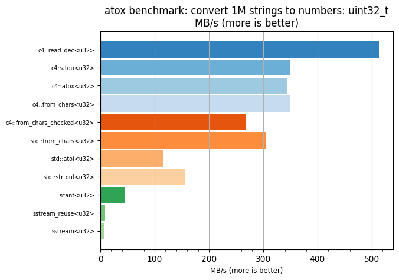 |
| 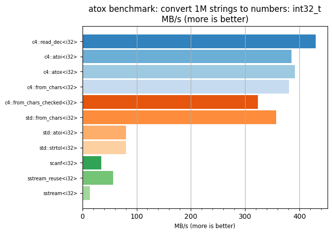 | 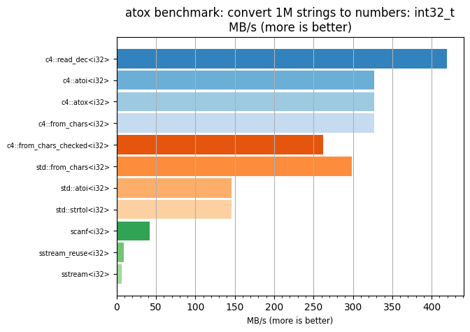 |
| 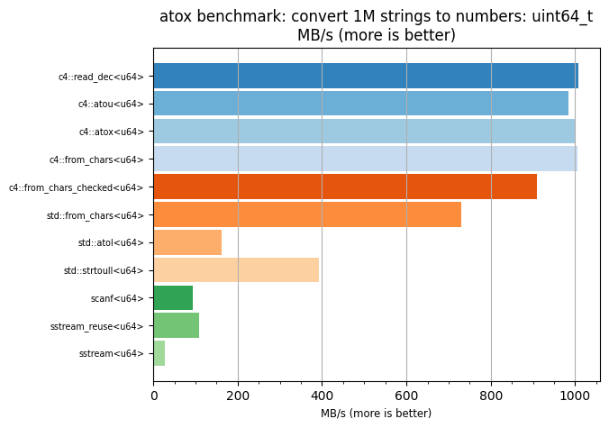 | 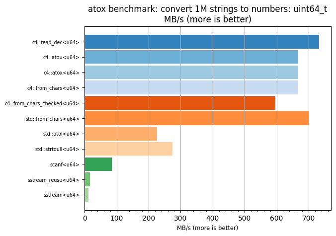 |
| 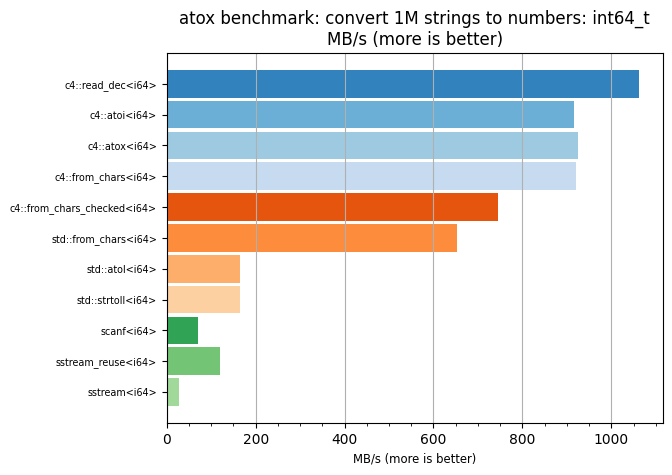 | 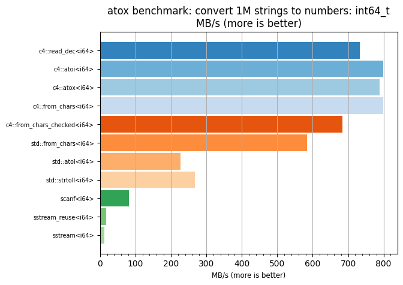 |
| 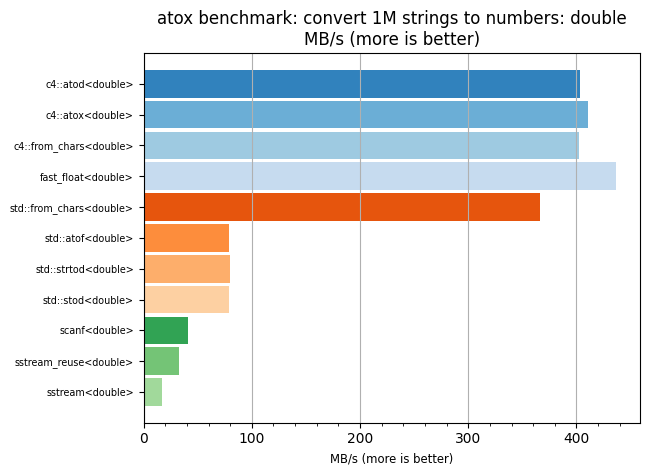 | 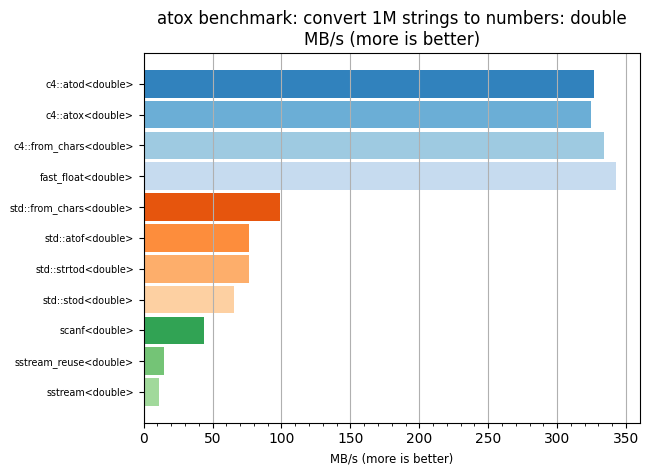 |
| 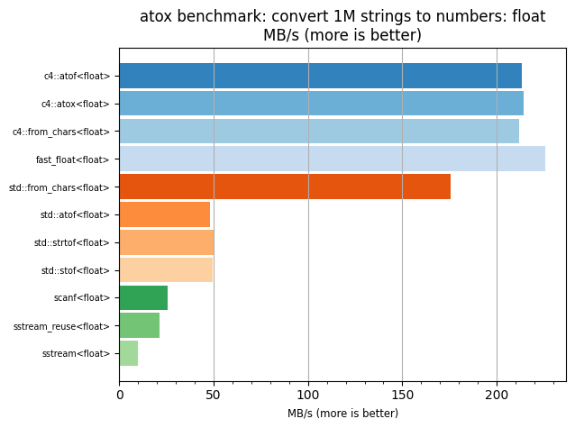 | 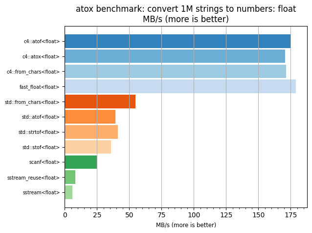 |
|      |      |
| 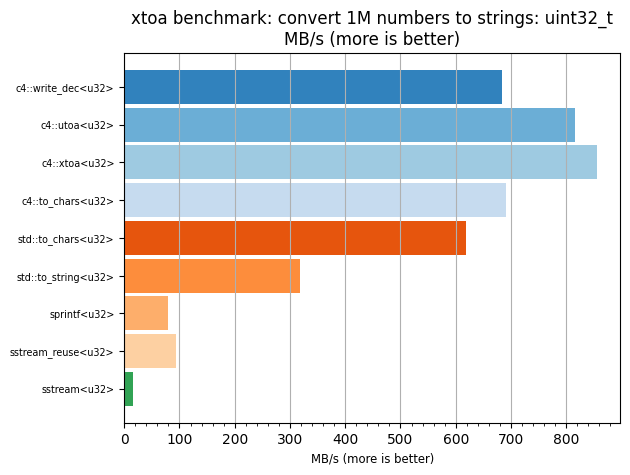 | 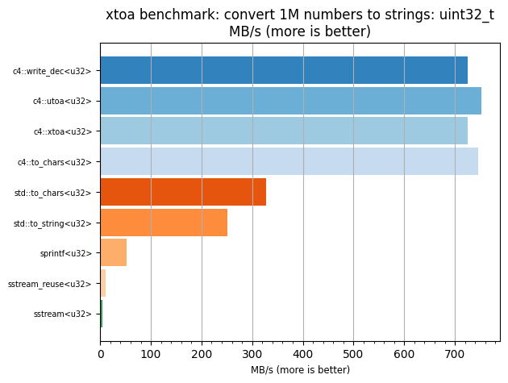 |
| 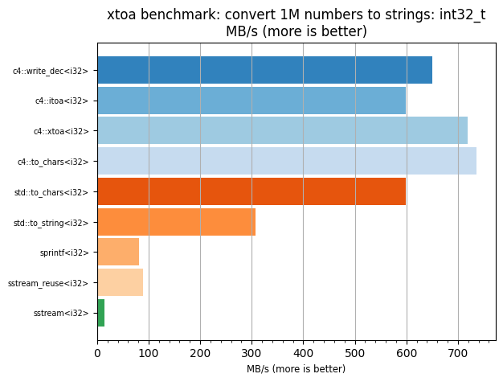 | 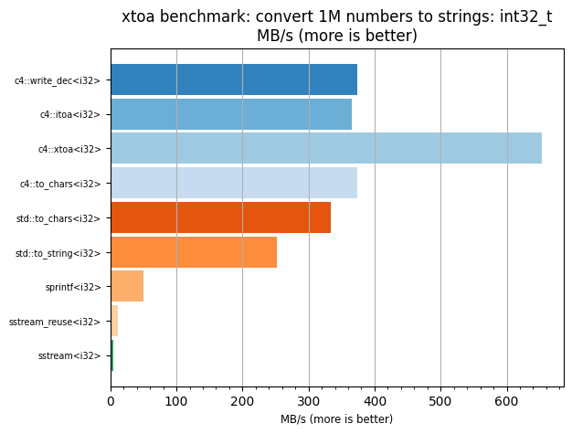 |
| 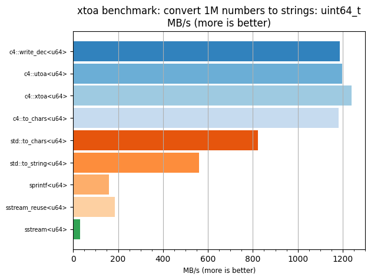 | 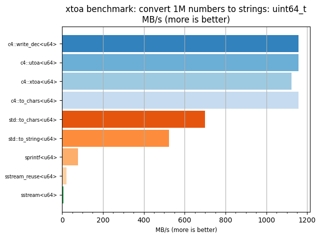 |
| 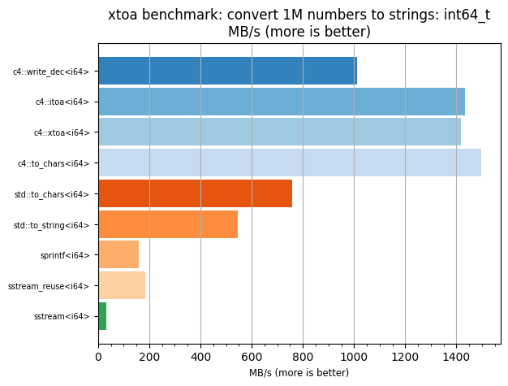 | 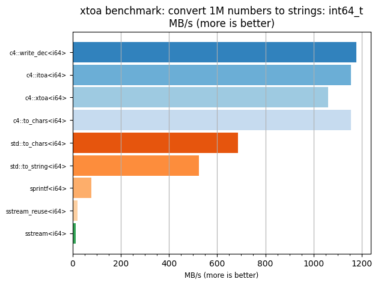 |


### String formatting and parsing

* [`#include <c4/format.hpp>`](src/c4/format.hpp)

* There is a [useful quickstart
sample](https://rapidyaml.readthedocs.io/latest/doxygen/group__doc__quickstart.html#gac2425b515eb552589708cfff70c52b14)
in rapidyaml's doxygen docs.

```c++
// TODO: elaborate on the topics:

c4::cat(), c4::uncat()
c4::catsep(), c4::uncatsep()
c4::format(), c4::unformat()

c4::catrs()
c4::catseprs()
c4::formatrs()

// formatting:
c4::fmt::overflow_checked
c4::fmt::real
c4::fmt::boolalpha
c4::fmt::dec
c4::fmt::hex
c4::fmt::oct
c4::fmt::bin
c4::fmt::zpad
c4::fmt::right
c4::fmt::left
c4::fmt::raw, c4::fmt::craw
c4::fmt::base64, c4::fmt::cbase64
```

### `c4::span` and `c4::blob`

* [`#include <c4/span.hpp>`](src/c4/span.hpp)
* [`#include <c4/blob.hpp>`](src/c4/blob.hpp)


### Enums and enum symbols

[`#include <c4/enum.hpp>`](src/c4/enum.hpp)

```c++
// TODO: elaborate on the topics:

c4::e2str(), c4::str2e()
```

### Bitmasks and bitmask symbols

[`#include <c4/bitmask.hpp>`](src/c4/bitmask.hpp)

```c++
// TODO: elaborate on the topics:

c4::bm2str(), c4::str2bm()
```

### Base64 encoding / decoding

[`#include <c4/base64.hpp>`](src/c4/base64.hpp)

### Fuzzy float comparison


### Multi-platform / multi-compiler utilities

```c++
// TODO: elaborate on the topics:
#include <c4/error.hpp>

C4_RESTRICT, $, c$, $$, c$$
#include <c4/restrict.hpp>
#include <c4/unrestrict.hpp>

#include <c4/windows_push.hpp>
#include <c4/windows_pop.hpp>

C4_UNREACHABLE()

c4::type_name()

// portable attributes
C4_LIKELY()/C4_UNLIKELY()
C4_ALWAYS_INLINE
C4_CONST
C4_PURE
C4_HOT
C4_COLD
```

### Runtime assertions and error handling

```c++
// TODO: elaborate on the topics:

error callback

C4_ASSERT()
C4_XASSERT()
C4_CHECK()

C4_ERROR()
C4_NOT_IMPLEMENTED()
```

### Memory allocation

```c++
// TODO: elaborate on the topics:

c4::aalloc(), c4::afree() // aligned allocation

c4::MemoryResource // global and scope

c4::Allocator
```

### Mass initialization/construction/destruction

```c++
// TODO: elaborate on the topics:

c4::make_room()/c4::destroy_room()
c4::construct()/c4::construct_n()
c4::destroy()/c4::destroy_n()
c4::copy_construct()/c4::copy_construct_n()
c4::copy_assign()/c4::copy_assign_n()
c4::move_construct()/c4::move_construct_n()
c4::move_assign()/c4::move_assign_n()
```
